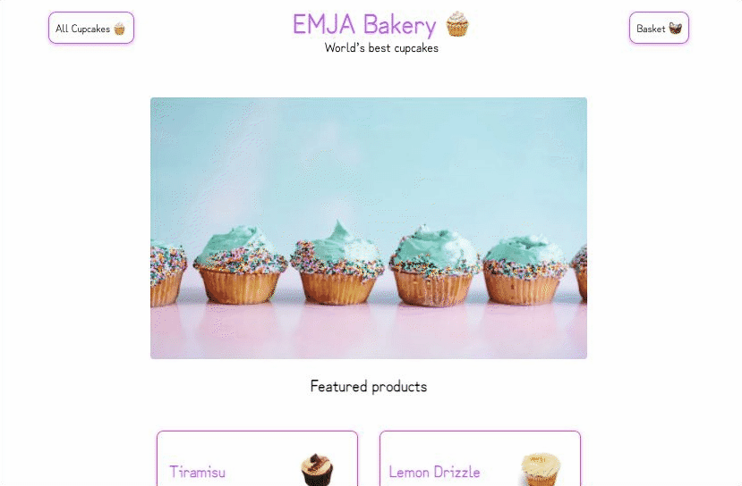
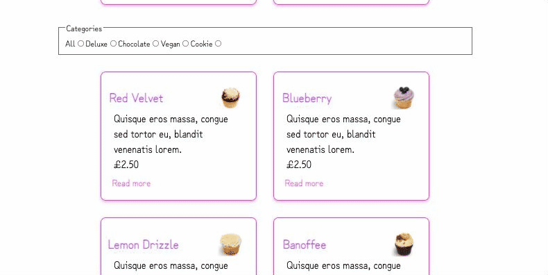
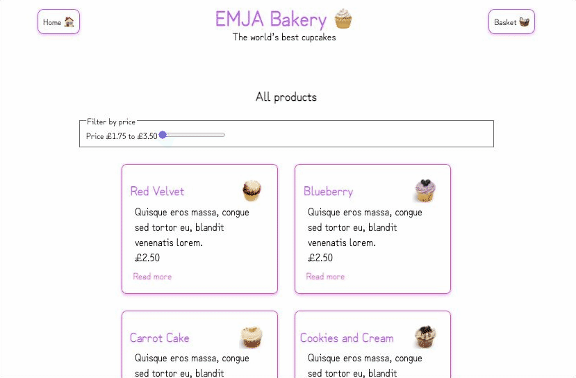

### EMJA Bakery 🧁

<small>The world's most delicious cupcakes</small> 🌍😋

[`Deployed version here`](https://week6-emja.vercel.app/)

### Roles 👥

UX - Elena

Facilitator - Ji

DevOps - Anna

QA - Mohammed

### Acceptance Criteria ✅

✔ Server-rendered with Next.js

✔ Hosted on Vercel

✔ Data stored in ElephantSQL Postgres

✔ Homepage with product listings

✔ Individual product pages, containing: quantity/colour/variant pickers

### Stretch goals 🙆‍♀️

🥳 “Add to basket” button on product pages 🧺

🥳 Basket page showing all saved items

🥳 Filter products by category

🥳 Filter products by price 💷

🥳 “Featured” products on homepage 🏡

### Future improvements 🕰

📍 Add cupcake quantity and size to basket page

📍 Authenticate users and save their basket contents for future visits

📍 Refactor our products page to render one list of products

📍 Change filter by price to sort by price

### What we learnt 📚

📍 How to build a full stack application in Next.js with a PSQL db 🧱

📍 How to deploy our app to Vercel

📍 How to use React to build our front end ⚛️

### Screenshots 👀

